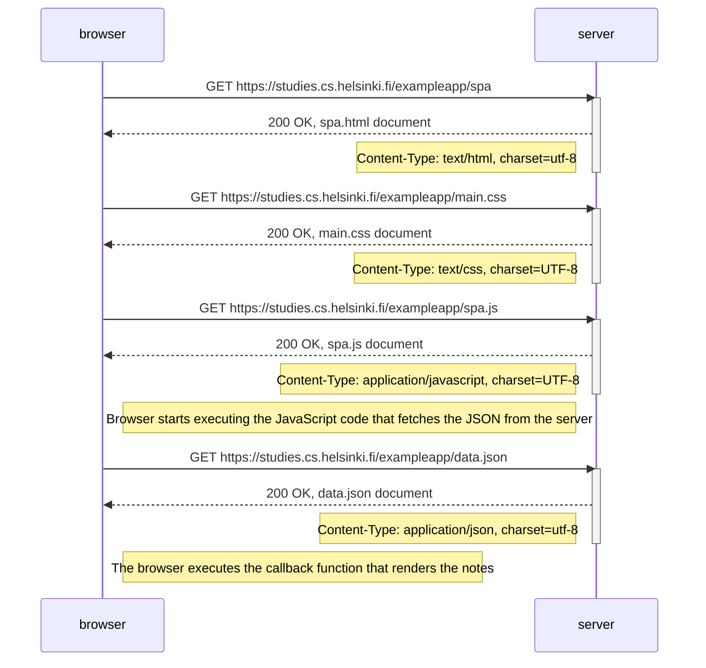

[Task Description Link](https://fullstackopen.com/en/part0/fundamentals_of_web_apps#:~:text=0.5%3A%20Single%20page%20app%20diagram)

```mermaid
sequenceDiagram
    participant browser
    participant server

    browser->>server: GET https://studies.cs.helsinki.fi/exampleapp/spa
    activate server
    server-->>browser: 200 OK, spa.html document
    Note left of server: Content-Type: text/html, charset=utf-8
    deactivate server

    browser->>server: GET https://studies.cs.helsinki.fi/exampleapp/main.css
    activate server
    server-->>browser: 200 OK, main.css document
    Note left of server: Content-Type: text/css, charset=UTF-8
    deactivate server

    browser->>server: GET https://studies.cs.helsinki.fi/exampleapp/spa.js
    activate server
    server-->>browser: 200 OK, spa.js document
    Note left of server: Content-Type: application/javascript, charset=UTF-8
    deactivate server

    Note right of browser: Browser starts executing the JavaScript code that fetches the JSON from the server

    browser->>server: GET https://studies.cs.helsinki.fi/exampleapp/data.json
    activate server
    server-->>browser: 200 OK, data.json document
    Note left of server: Content-Type: application/json, charset=utf-8
    deactivate server

    Note right of browser: The browser executes the callback function that renders the notes
```
