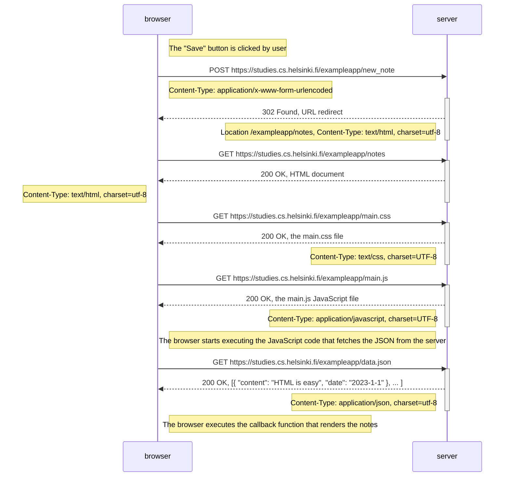

[Task Description Link](https://fullstackopen.com/en/part0/fundamentals_of_web_apps#:~:text=0.4%3A%20New%20note%20diagram)

```mermaid
sequenceDiagram
    participant browser
    participant server

    Note right of browser: The "Save" button is clicked by user
    browser->>server: POST https://studies.cs.helsinki.fi/exampleapp/new_note
    Note right of browser: Content-Type: application/x-www-form-urlencoded
    activate server
    server-->>browser: 302 Found, URL redirect
    Note left of server: Location /exampleapp/notes, Content-Type: text/html, charset=utf-8
    deactivate server
    
    browser->>server: GET https://studies.cs.helsinki.fi/exampleapp/notes
    activate server
    server-->>browser: 200 OK, HTML document
    Note left of browser: Content-Type: text/html, charset=utf-8
    deactivate server

    browser->>server: GET https://studies.cs.helsinki.fi/exampleapp/main.css
    activate server
    server-->>browser: 200 OK, the main.css file
    Note left of server: Content-Type: text/css, charset=UTF-8
    deactivate server

    browser->>server: GET https://studies.cs.helsinki.fi/exampleapp/main.js
    activate server
    server-->>browser: 200 OK, the main.js JavaScript file
    Note left of server: Content-Type: application/javascript, charset=UTF-8
    deactivate server

    Note right of browser: The browser starts executing the JavaScript code that fetches the JSON from the server

    browser->>server: GET https://studies.cs.helsinki.fi/exampleapp/data.json
    activate server
    server-->>browser: 200 OK, [{ "content": "HTML is easy", "date": "2023-1-1" }, ... ]
    Note left of server: Content-Type: application/json, charset=utf-8
    deactivate server

    Note right of browser: The browser executes the callback function that renders the notes
```
