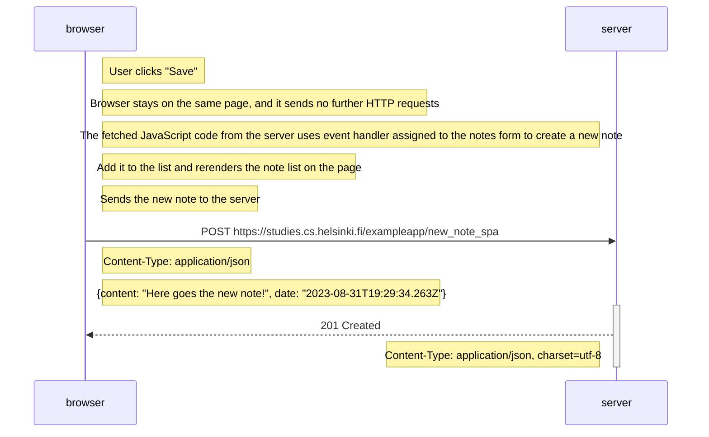

[Task Description Link](https://fullstackopen.com/en/part0/fundamentals_of_web_apps#:~:text=0.6%3A%20New%20note%20in%20Single%20page%20app%20diagram)

```mermaid
sequenceDiagram
    participant browser
    participant server

    Note right of browser: User clicks "Save"

    Note right of browser: Browser stays on the same page, and it sends no further HTTP requests
    Note right of browser: The fetched JavaScript code from the server uses event handler assigned to the notes form to create a new note
    Note right of browser: Add it to the list and rerenders the note list on the page
    Note right of browser: Sends the new note to the server

    browser->>server: POST https://studies.cs.helsinki.fi/exampleapp/new_note_spa
    Note right of browser: Content-Type: application/json
    Note right of browser: {content: "Here goes the new note!", date: "2023-08-31T19:29:34.263Z"}

    

    activate server
    server-->>browser: 201 Created
    Note left of server: Content-Type: application/json, charset=utf-8
    deactivate server
```
